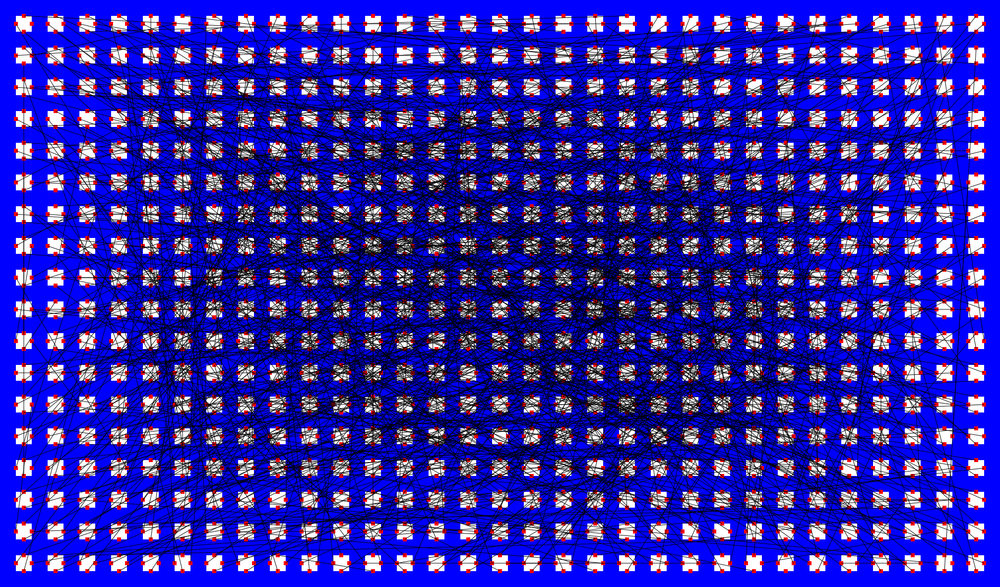

# Project GoodChip

## Example training image

# Real World Problem
There are billions of transistors in modern chips. It is the goal of the designer to make sure the connections between the transistors can be realized. 
One of the metrics leading to a "good chip" is to reduce the number of crossings of these connections. Other metrics leading to better connections are component 
alignment, and distributed connection density. 
One of the characteristics of Electronic Design Automation (EDA) that makes it ripe for ML is that it is a virtual world. 
We don't have to harvest X-Rays, or go around the world taking pictures of road signs. We can create them!

## Training Data Repository
This directory contains two sets of a data. Once the generator has been run, they will appear.
- A collection of images that show a set of components, pins and connections.  The best chips have fewer crossing connections. 
- A file that contains a list of filenames along with a label that represents the percentage of crossings
The code to generate new images, that are statistically similar to real chips is part of this package. Please use generator.py to create more images and 
The goal is to write a model that predicts the crossing percentage from the picture. 
The pictures are generated via a python script but statistically look like real chips. After the model is developed that demonstrates good correlation, 
- more images can be generated.
It would be interesting to see how the correlation changes with the number of images in the training set.
If time permits 2 models could be trained on different image sets. If the two models match in prediction, then the confidence is high,
otherwise the confidence is low in the prediction.
## Goals
- Clone or Fork this repo. Insure you can build and run the generator
- look at the generated image files and the associated labels.csv file. Visually try to understand teh components, pins and connections. Do you see more intersections in files that have a higher score?
- Change the code to not generate a double number but a binary value that represents if the number > some predetermined value.
- Build an image to number CNN that uses the training data to predict the intersection score on novel data.
- Build larger training sets, how does the accuracy change?
- The code is also capable of generating congestion. How might congestion be a better metric?
## Instructions on how to build your training data
git clone https://github.com/taylorhogan/goodchip

python3 -m venv ./venv

source ./venv/bin/activate

pip install -r requirements.txt
# How to generate a new training set
python3 generator.py
## How to change the style/morphology of the training data
The config.py file contains a few ways to change the morphology of the training data. This will certainly expand in the future. 
The drawing styles, such as the absence of certain layers would be nice.
## Future Developments
Feel free to keep up to date on this repo. Or better yet submit a pull request for Currently all devices are of the same instance. 
This should change to exhibit more diversity. 
## Reading Material

[Best book on Deep Learning (IMO)](https://www.amazon.com/Learning-Python-Second-Fran%C3%A7ois-Chollet/dp/1617296864/ref=sr_1_1?crid=1JOCH8GC3NCAM&dib=eyJ2IjoiMSJ9.I8xJfgtsdFfwp_oX6p4AHEI1N5ypW4-XfJl33s7tIpOpCFwLdHbdEFx5-ni-TQ2dDDahNUMrlgRZeEO2O-qDwSzIRJs2GQJ8n0cQhlsjrcvsiHDChJDI9NqQG6wYKNo8B-tSovIcPF0J3niNWttbnPTCm-U9VPJtEf_QMhfX7PAw-kna04eUKWUJE0GttxL5VUxvXZ9ZrVZfVHLtCAE6EutgyM3QkJ2TIgUZ5HD2lvI.76LRNexk_WwbNfvoJk_gTTjHgzdXs8_duAcEBmfEn4c&dib_tag=se&keywords=francois+chollet&qid=1723382182&sprefix=francois+ch%2Caps%2C133&sr=8-1)

## Generator Code Repo
Sorry for the sparsity of comments. The small DB is a very lightweight version of Verilog and .lef/.def 

