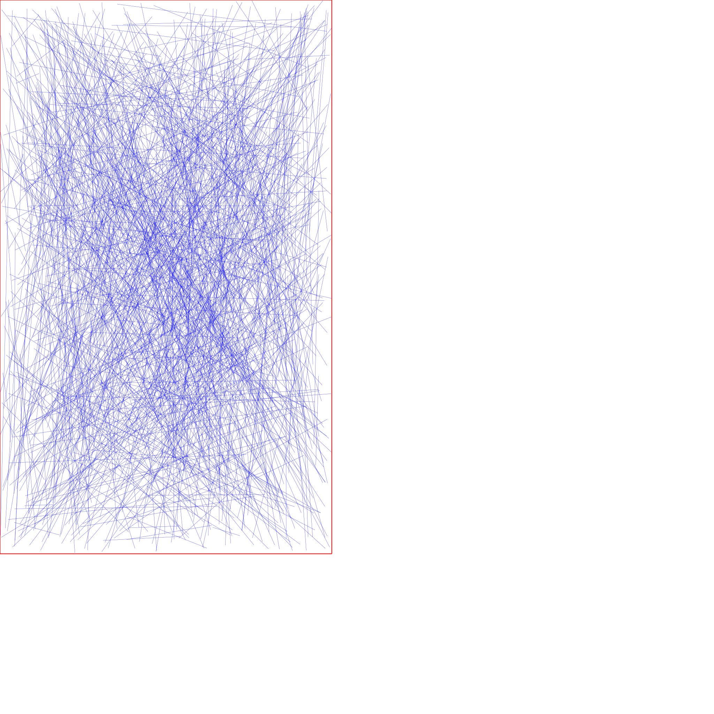

# Project GoodChip

There are billions of transistors in modern chips. It is the goal of the designer to make sure the connections between the transistors can be realized.
One of the metrics leading to a "good chip" is to reduce the number of crossings of these connections.

## Training Data Repository
This directory contains two sets of a data. 
- A collection of images that show a set of crossing lines. Each image represents the connections that must be made on chip. The best chips have fewer crossing lines. 
- A file that contains a list of filenames along with a label that represents the percentage of crossings

The goal is to write a model that predicts the crossing percentage from the picture. 
The pictures are generated via a python script but statistically look like real chips. After the model is developed that demonstrates good correlation, more images can be generated.
It would be interesting to see how the correlation changes with the number of images in the training set.
If time permits 2 models could be trained on different image sets. If the two models match in prediction, then the confidence is high, otherwised the confidence is low in the prediction.
