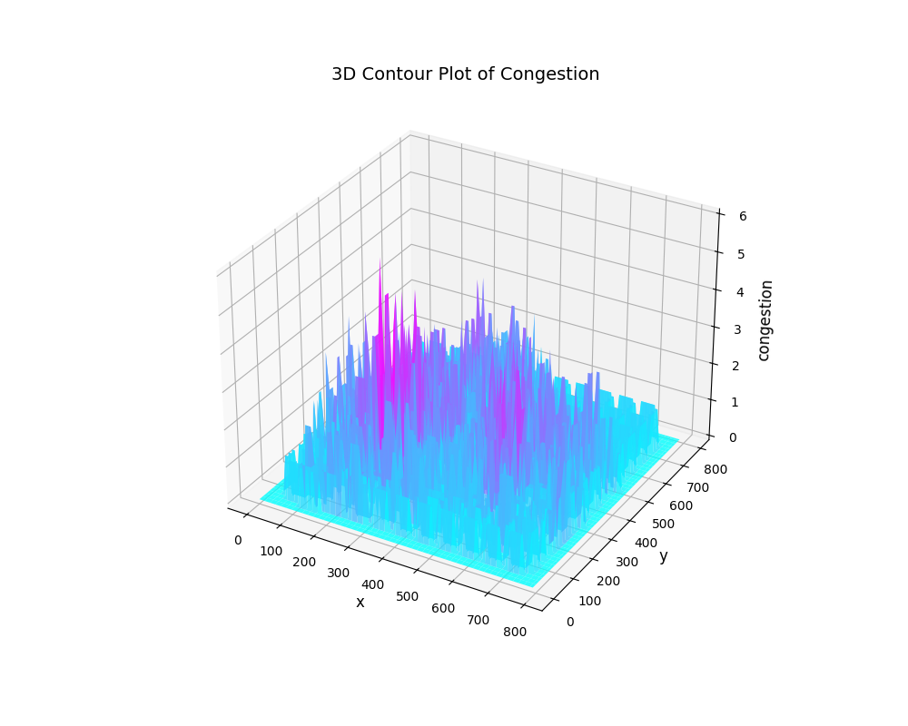
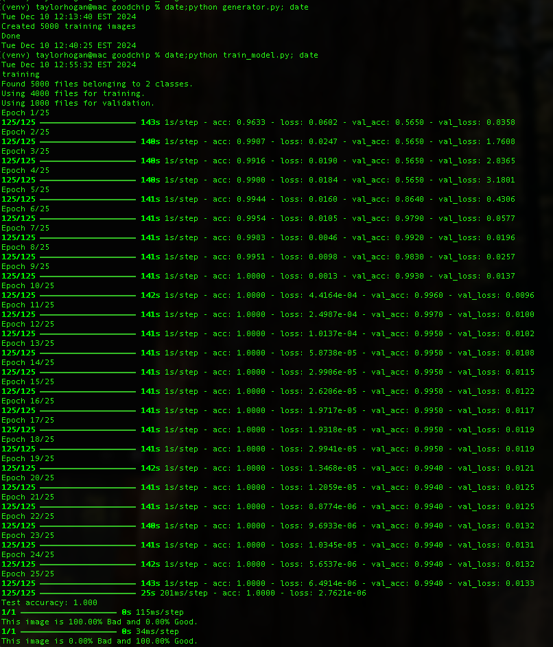

# Project GoodChip

## Example training image

## Potentially Congestion can be calculated as a fitness function

# Real World Problem
There are billions of transistors in modern chips. It is the goal of the designer to make sure the connections between the transistors can be realized. 
One of the metrics leading to a "good chip" is to reduce the number of crossings of these connections. Other metrics leading to better connections are component 
alignment, and distributed connection density. 
One of the characteristics of Electronic Design Automation (EDA) that makes it ripe for ML is that it is a virtual world. 
We don't have to harvest X-Rays, or go around the world taking pictures of road signs. We can create them!
# Motivation for ML
EDA software as well as most engineering software is dominated by single thread execution. Past computational thinking, indeed the foundation of modern computer science curriculums
is just countless examples of non-parallel programming. Determining the number of crossings of n lines is at best O(n LOG n) in time complexity. Most naive algorithms are O(n**2). The 
beauty of neural nets is that evaluation (inference) is constant time, and on a GPU its 100s per second, independent of the size of n. Why is this important. Almost all automation
algorithms need a goal or fitness function. Independent of the method of searching the solution space, these algorithms need to test a solution. This testing is always the limiting factor in
speed, thus the limiting factor is finding a good solution. A human does not count the crossings or calculate the congestion, he/she will look at it and can make a good decision very fast. This
is exactly what the neural net is doing, but with much greater speed and accuracy compared to the human. Yes moving the problem to the GPU is expensive. But so many fitness functions can be run 
in parallel, think crossings, congestion, alignment. These can all be done at the same time. Even greater advantages can be realized if the entire optimization algorithm is moved to the GPU.
## Training Data Repository
This directory contains two sets of a data. Once the generator has been run, they will appear.
- A collection of images that show a set of components, pins and connections.  The best chips have fewer crossing connections. 
- A file that contains a list of filenames along with a label that represents the percentage of crossings
The code to generate new images, that are statistically similar to real chips is part of this package. Please use generator.py to create more images and 
The goal is to write a model that predicts the crossing percentage from the picture. 
The pictures are generated via a python script but statistically look like real chips. After the model is developed that demonstrates good correlation, 
- more images can be generated.
It would be interesting to see how the correlation changes with the number of images in the training set.
If time permits 2 models could be trained on different image sets. If the two models match in prediction, then the confidence is high,
otherwise the confidence is low in the prediction.
## Goals
- Clone or Fork this repo. Insure you can build and run the generator
- look at the generated image files and the associated labels.csv file. Visually try to understand teh components, pins and connections. Do you see more intersections in files that have a higher score?
- Change the code to not generate a double number but a binary value that represents if the number > some predetermined value.
- Build an image to number CNN that uses the training data to predict the intersection score on novel data.
- Build larger training sets, how does the accuracy change?
- The code is also capable of generating congestion. How might congestion be a better metric?
## Instructions on how to build your training data
git clone https://github.com/taylorhogan/goodchip

python3 -m venv ./venv

source ./venv/bin/activate

pip install -r requirements.txt
# How to generate a new training set
python3 generator.py
## How to change the style/morphology of the training data
The config.py file contains a few ways to change the morphology of the training data. This will certainly expand in the future. 
The drawing styles, such as the absence of certain layers would be nice.
## How to train and evaluate
python3 train_model.py

I suspect the excellent inference is due to the idea that validation images are also in the training set. I will work to
change this and run more tests.

## Code Flow
### The flow is basically Generation->Training->Inference

- There is a exist a simple EDA data base. A veneer of effort was made to insure the physical properies mimic
lef/def and the hierarchy mimics verilog
- The generation includes building sample data bases each with different morphology. 
- Each data base is turned into a picture
- Each data base is used to generate ground truth "goodness"
- images are classified as being good or bad and moved into respective folders, along with a .csv file correlatig
the goodness along with the name of the file.
- This data is used to train the CNN
- You can individually test pictures through the eval_model.py method

## Future Developments
- Determine sensitivity to accuracy vs epoch/batch_size/distribution_style
- Different morphologies of training data
## Reading Material

[Best book on Deep Learning (IMO)](https://www.amazon.com/Learning-Python-Second-Fran%C3%A7ois-Chollet/dp/1617296864/ref=sr_1_1?crid=1JOCH8GC3NCAM&dib=eyJ2IjoiMSJ9.I8xJfgtsdFfwp_oX6p4AHEI1N5ypW4-XfJl33s7tIpOpCFwLdHbdEFx5-ni-TQ2dDDahNUMrlgRZeEO2O-qDwSzIRJs2GQJ8n0cQhlsjrcvsiHDChJDI9NqQG6wYKNo8B-tSovIcPF0J3niNWttbnPTCm-U9VPJtEf_QMhfX7PAw-kna04eUKWUJE0GttxL5VUxvXZ9ZrVZfVHLtCAE6EutgyM3QkJ2TIgUZ5HD2lvI.76LRNexk_WwbNfvoJk_gTTjHgzdXs8_duAcEBmfEn4c&dib_tag=se&keywords=francois+chollet&qid=1723382182&sprefix=francois+ch%2Caps%2C133&sr=8-1)

